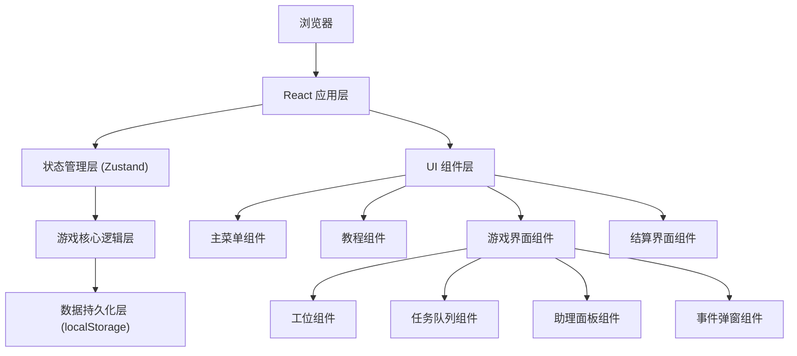

## 1. Architecture Design



## 2. Technology Description

- **前端框架**: React 18 + TypeScript
- **构建工具**: Vite 5
- **状态管理**: Zustand 4
- **路由管理**: React Router DOM 6
- **样式方案**: Tailwind CSS 3
- **图标库**: Lucide React
- **拖拽交互**: @dnd-kit/core + @dnd-kit/sortable
- **数据持久化**: localStorage
- **动画**: CSS Transitions + Framer Motion（可选）

## 3. Route Definitions

| Route | 页面 | Purpose |
|-------|------|---------|
| / | 主菜单 | 显示游戏标题、关卡选择、最高分、教程入口 |
| /tutorial | 教程 | 显示游戏玩法说明和操作指南 |
| /game/:levelId | 游戏界面 | 核心游戏玩法界面 |
| /result/:levelId | 结算界面 | 显示本局评分、最高分对比、改进建议 |

## 4. Data Model

### 4.1 核心类型定义

```typescript
// 任务类型
type TaskType = 'sandpaper' | 'cleanup' | 'oiling' | 'admission';

// 工位状态
type StationStatus = 'idle' | 'in-use' | 'needs-cleaning' | 'cleaning';

// 助理状态
type AssistantStatus = 'idle' | 'busy' | 'away';

// 事件类型
type EventType = 'cleanup-difficulty' | 'material-delay' | 'early-arrival' | 'assistant-leave';

// 任务
interface Task {
  id: string;
  type: TaskType;
  stationId?: string;
  estimatedTime: number;
  remainingTime: number;
  assignedAssistantId?: string;
  status: 'pending' | 'in-progress' | 'completed';
  priority: number;
  batchNumber: number;
}

// 工位
interface Station {
  id: string;
  number: number;
  status: StationStatus;
  currentTaskId?: string;
  cleanupProgress: number;
}

// 助理
interface Assistant {
  id: string;
  name: string;
  status: AssistantStatus;
  currentTaskId?: string;
  awayTimeRemaining: number;
  totalIdleTime: number;
  totalBusyTime: number;
}

// 游戏事件
interface GameEvent {
  id: string;
  type: EventType;
  title: string;
  description: string;
  timeLimit: number;
  timeRemaining: number;
  affectedTaskId?: string;
  affectedStationId?: string;
  affectedAssistantId?: string;
  handled: boolean;
}

// 关卡配置
interface LevelConfig {
  id: number;
  name: string;
  description: string;
  batches: number;
  stations: number;
  assistants: number;
  eventFrequency: 'low' | 'medium' | 'high' | 'extreme';
  targetTime: number;
}

// 评分结果
interface ScoreResult {
  stationRecoveryRate: number;
  admissionDelay: number;
  assistantIdleRatio: number;
  missedEvents: number;
  totalTime: number;
  totalScore: number;
  grade: 'S' | 'A' | 'B' | 'C' | 'D';
}

// 游戏记录
interface GameRecord {
  levelId: number;
  score: ScoreResult;
  timestamp: number;
  isHighScore: boolean;
}

// 游戏状态
interface GameState {
  currentLevel: LevelConfig | null;
  gameStatus: 'idle' | 'playing' | 'paused' | 'completed';
  currentBatch: number;
  totalBatches: number;
  elapsedTime: number;
  stations: Station[];
  assistants: Assistant[];
  taskQueue: Task[];
  activeEvents: GameEvent[];
  eventLog: { event: GameEvent; handled: boolean; time: number }[];
  admissionTimes: { planned: number; actual: number }[];
  totalStationsUsed: number;
  totalStationsCleaned: number;
}
```

### 4.2 状态管理切片

```typescript
// Zustand Store 结构
interface GameStore {
  // 状态
  gameState: GameState;
  highScores: Record<number, ScoreResult>;
  
  // 游戏控制
  startGame: (levelId: number) => void;
  pauseGame: () => void;
  resumeGame: () => void;
  restartGame: () => void;
  completeGame: () => void;
  
  // 任务操作
  reorderTasks: (taskIds: string[]) => void;
  assignAssistant: (taskId: string, assistantId: string) => void;
  unassignAssistant: (taskId: string) => void;
  
  // 事件操作
  handleEvent: (eventId: string) => void;
  
  // 游戏循环
  tick: (deltaTime: number) => void;
  
  // 分数计算
  calculateScore: () => ScoreResult;
  saveScore: () => void;
  getImprovementSuggestion: (score: ScoreResult) => string;
}
```

## 5. 核心模块说明

### 5.1 游戏引擎 (useGameEngine hook)

- 管理游戏主循环，每秒更新游戏状态
- 处理任务进度更新
- 随机触发游戏事件
- 更新助理和工位状态

### 5.2 任务系统 (taskSystem.ts)

- 生成批次任务序列
- 计算任务预估时间
- 处理任务优先级调整
- 任务完成判定

### 5.3 事件系统 (eventSystem.ts)

- 根据关卡配置的事件频率随机生成事件
- 管理事件倒计时
- 处理事件效果（增加耗时、助理离开等）
- 记录事件处理结果

### 5.4 评分系统 (scoringSystem.ts)

- 计算各项评分指标
- 综合评分和等级评定
- 生成改进建议
- 最高分比较

### 5.5 存储系统 (storage.ts)

- 读写 localStorage 中的最高分记录
- 序列化/反序列化游戏数据
- 数据迁移和版本管理

## 6. 项目目录结构

```
src/
├── components/           # UI 组件
│   ├── MainMenu/         # 主菜单组件
│   ├── Tutorial/         # 教程组件
│   ├── GameBoard/        # 游戏主界面
│   │   ├── StationCard.tsx
│   │   ├── TaskQueue.tsx
│   │   ├── AssistantPanel.tsx
│   │   ├── EventPopup.tsx
│   │   └── GameHeader.tsx
│   └── Result/           # 结算界面
│       ├── ScorePanel.tsx
│       └── SuggestionCard.tsx
├── hooks/                # 自定义 Hooks
│   ├── useGameEngine.ts
│   └── useDragDrop.ts
├── store/                # 状态管理
│   └── useGameStore.ts
├── systems/              # 游戏系统
│   ├── taskSystem.ts
│   ├── eventSystem.ts
│   └── scoringSystem.ts
├── data/                 # 配置数据
│   ├── levels.ts
│   └── constants.ts
├── types/                # 类型定义
│   └── index.ts
├── utils/                # 工具函数
│   ├── storage.ts
│   └── helpers.ts
├── pages/                # 页面组件
│   ├── MainMenuPage.tsx
│   ├── TutorialPage.tsx
│   ├── GamePage.tsx
│   └── ResultPage.tsx
├── App.tsx
├── main.tsx
└── index.css
```
