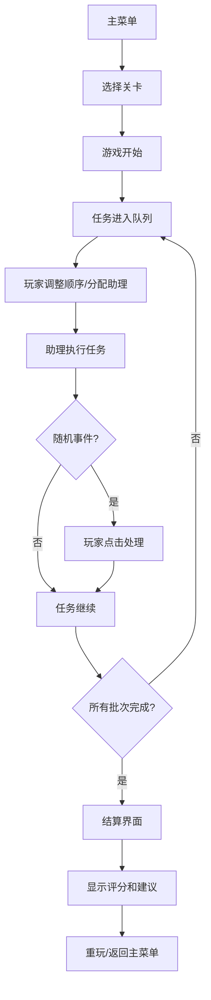

## 1. 产品概述

木作体验区管理游戏是一款轻量级模拟经营游戏，玩家扮演木作工坊管理员，通过合理安排砂纸发放、工位清理、上油等待和下一批入场等任务，处理各类突发事件，优化体验流程，减少参与者等待时间。

- 目标用户：喜欢轻量级策略模拟游戏的玩家
- 核心价值：考验玩家的时间管理和应急处理能力，提供轻松有趣的游戏体验

## 2. 核心 Features

### 2.1 Feature Module

1. **主菜单界面**：游戏开始、关卡选择、教程入口、最高分记录
2. **教程界面**：游戏玩法说明、任务介绍、事件处理指南
3. **游戏主界面**：工位状态显示、任务队列、助理管理、事件通知、计时系统
4. **结算界面**：本局过程摘要、评分详情、最高分对比、改进建议
5. **事件系统**：工位清理困难、材料包延迟、参与者提前到达、助理临时离开

### 2.3 Page Details

| 页面名称 | 模块名称 | 功能描述 |
|-----------|-------------|---------------------|
| 主菜单 | 关卡选择 | 显示4个关卡，选择后进入对应关卡 |
| 主菜单 | 最高分记录 | 显示各关卡历史最高分 |
| 主菜单 | 教程入口 | 点击进入教程界面 |
| 游戏界面 | 工位显示 | 显示所有工位状态（空闲/使用中/需清理） |
| 游戏界面 | 任务队列 | 可拖拽调整任务顺序，分配助理执行 |
| 游戏界面 | 事件通知 | 突发事件弹窗，需玩家点击处理 |
| 游戏界面 | 暂停控制 | 暂停/继续游戏 |
| 结算界面 | 评分详情 | 显示5项评分：工位恢复率、入场延误、助理空闲比例、事件遗漏、总耗时 |
| 结算界面 | 改进建议 | 根据评分给出一条针对性改进建议 |

## 3. 核心 Process

玩家从主菜单选择关卡进入游戏 → 游戏开始后任务自动进入队列 → 玩家调整任务顺序并分配助理 → 助理按顺序执行任务 → 随机触发突发事件需玩家点击处理 → 所有批次入场完成后进入结算 → 显示评分和改进建议 → 可重玩或返回主菜单

## 4. User Interface Design

### 4.1 Design Style

- **主色调**：温暖的原木色系（棕色、米色、琥珀色），配合绿色作为安全/完成标识，红色作为警告/事件标识
- **按钮风格**：圆角矩形，带有轻微木纹质感，悬停时有阴影加深效果
- **字体**：使用 "Noto Serif SC" 作为标题字体，营造手工质感；"Noto Sans SC" 作为正文字体，确保可读性
- **布局风格**：卡片式布局，模拟工作台面，工位用卡片展示，任务队列用列表展示
- **图标风格**：使用 lucide-react 图标，配合 emoji 增强亲和力（🪵 🌰 ✂️ 🧴 📦）

### 4.2 Page Design Overview

| 页面名称 | 模块名称 | UI Elements |
|-----------|-------------|-------------|
| 主菜单 | 标题区 | 大字号游戏标题，木质纹理背景，轻微阴影 |
| 主菜单 | 关卡卡片 | 4个关卡卡片，显示关卡名称、难度、最高分 |
| 游戏界面 | 顶部状态栏 | 计时器、当前批次、暂停按钮、得分预览 |
| 游戏界面 | 工位区 | 横向排列的工位卡片，显示状态和进度条 |
| 游戏界面 | 任务队列 | 可拖拽任务列表，显示任务类型、预估时间、分配的助理 |
| 游戏界面 | 助理面板 | 显示助理状态（空闲/忙碌），可拖拽分配到任务 |
| 游戏界面 | 事件弹窗 | 从右侧滑入的事件卡片，醒目的处理按钮 |
| 结算界面 | 评分面板 | 5个评分项的横向条形图，彩色区分 |
| 结算界面 | 建议卡片 | 带图标的建议文本框 |

### 4.3 Responsiveness

- 桌面端优先设计，最小支持 1024px 宽度
- 中等屏幕（768-1024px）：调整为两列布局
- 移动端（<768px）：单列垂直布局，简化交互

## 5. 游戏机制

### 5.1 任务类型

| 任务 | 耗时 | 说明 |
|------|------|------|
| 砂纸发放 | 5秒 | 为下一批参与者准备砂纸 |
| 工位清理 | 10秒 | 清理使用完毕的工位 |
| 上油等待 | 15秒 | 等待木制品上油干燥 |
| 下一批入场 | 8秒 | 引导新一批参与者进入 |

### 5.2 事件类型

| 事件 | 影响 | 处理方式 |
|------|------|----------|
| 工位清理困难 | 清理时间增加50% | 点击分配额外助理 |
| 材料包延迟 | 入场时间推迟10秒 | 点击确认并重新安排 |
| 参与者提前到达 | 需立即安排入场 | 点击优先处理 |
| 助理临时离开 | 该助理10秒内不可用 | 点击重新分配任务 |

### 5.3 评分标准

- **工位恢复率**：已清理工位数 / 总使用工位数 × 100%
- **入场延误**：实际入场时间 - 计划入场时间，越少越好
- **助理空闲比例**：助理总空闲时间 / 总游戏时间，适中最好（30%左右最佳）
- **事件遗漏**：未在规定时间内处理的事件数，越少越好
- **总耗时**：完成所有批次的总时间，越少越好

### 5.4 关卡设计

| 关卡 | 批次数 | 工位数 | 助理数 | 事件频率 | 目标时间 |
|------|--------|--------|--------|----------|----------|
| 第1关：入门工坊 | 3批 | 4个 | 2个 | 低 | 120秒 |
| 第2关：忙碌午后 | 5批 | 6个 | 2个 | 中 | 180秒 |
| 第3关：周末高峰 | 7批 | 8个 | 3个 | 高 | 240秒 |
| 第4关：大师挑战 | 10批 | 10个 | 3个 | 极高 | 300秒 |
